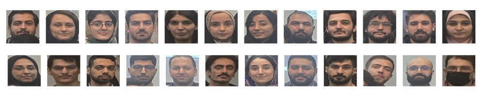
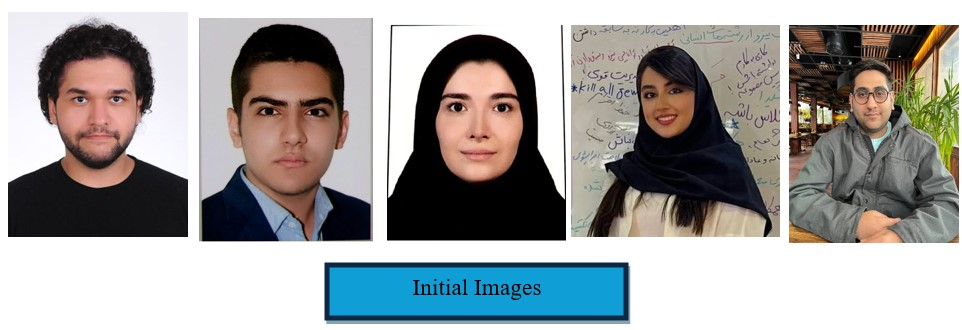
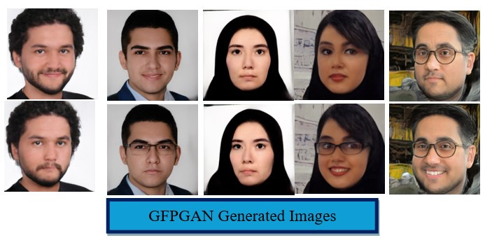
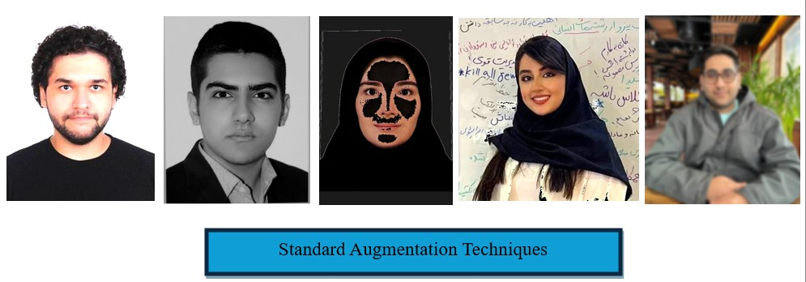
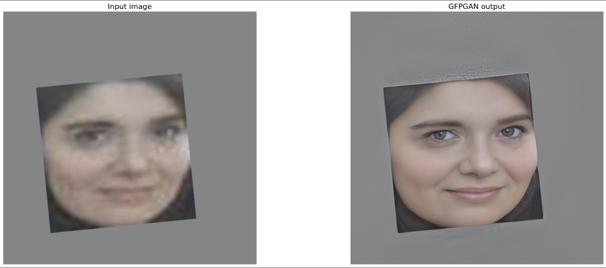
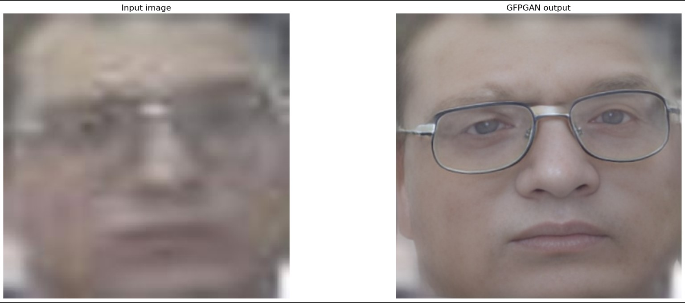

# Facial Recognition Attendance System

An end-to-end facial recognition pipeline built as a volunteer project for a
**Data Mining Algorithms and Applications** graduate course. Given a single
group photo of a classroom, the system detects every face, identifies the
students, and records their attendance in an Excel sheet — with an additional
real-time webcam recognition mode.

Everything is wrapped in an interactive **Streamlit** app.

---

## Pipeline

The project is built as a multi-stage pipeline, each stage tackling a real
constraint of doing face recognition on a tiny, single-image-per-person dataset.

### 1. Extracting faces from a photo

[MTCNN](https://github.com/ipazc/mtcnn) detects and crops every face from a
classroom photo. These crops become the input for every later stage.



### 2. Data augmentation

With only **one image per student**, variations in pose and expression are
synthesized using an [in-domain GAN](https://github.com/genforce/idinvert),
which can even add features like glasses — plus standard augmentations
(rotation, blur, color jitter, contrast, grayscale, noise).

| Initial images | In-domain GAN generated | Standard augmentations |
| :---: | :---: | :---: |
|  |  |  |

### 3. Super-resolution

[GFPGAN](https://github.com/TencentARC/GFPGAN) enhances low-resolution crops
into clearer, more recognizable faces.





### 4. Recognition

[DeepFace](https://github.com/serengil/deepface) with pre-trained
**Facenet512** / **VGG-Face** models extracts embeddings and identifies each
detected face.

### 5. Attendance logging

Recognized students are written to `Attendance.xlsx`, one sheet per date.

### 6. Real-time mode

[dlib](https://github.com/davisking/dlib) +
[face_recognition](https://github.com/ageitgey/face_recognition) drive live
webcam recognition for instant identification.

### 7. Streamlit integration & GPU acceleration

All of the above sits behind a single Streamlit UI, with CUDA + cuDNN
configured to run the deep-learning models on the GPU.

---

## Project structure

```
face_recognition_app/
├── app.py                        # Streamlit landing page (pipeline overview)
├── pages/
│   ├── deepface.py               # Photo → face detection → recognition → attendance
│   └── real_time_recognition.py  # Live webcam recognition
└── *.jpg / *.png                 # Illustrative images used by the app

Face_Recognition.ipynb            # Main research / experimentation notebook
Face_Recognition_Library.ipynb    # face_recognition-library experiments
Papers/                           # Reference papers
```

> **Not included in this repository** (see `.gitignore`): the student face-image
> datasets (privacy), pre-computed encodings (`*.pkl`), model weights (`*.pth`),
> vendored `dlib/` and `GFPGAN/` source trees, and multi-GB CUDA/cuDNN
> installers. These are regenerated or installed locally — see below.

---

## Getting started

### 1. Install dependencies

```bash
python -m venv venv
source venv/bin/activate        # Windows: venv\Scripts\activate
pip install -r requirements.txt
```

**`face_recognition` / `dlib` note:** `dlib` needs a C++ toolchain (and CMake)
to build. On Linux/macOS `pip install dlib` usually works once build tools are
present; on Windows the simplest path is a prebuilt wheel or conda. GPU users
should install a CUDA/cuDNN-enabled build of the deep-learning backend.

### 2. Provide the runtime assets

Because the datasets and weights are gitignored, you'll need to supply them
locally:

- **GFPGAN weights** — place `detection_Resnet50_Final.pth` and
  `parsing_parsenet.pth` under `face_recognition_app/gfpgan/weights/`
  (auto-downloaded by GFPGAN on first run, or fetch from the GFPGAN repo).
- **Face encodings** — the real-time mode expects a `face_encodings.pkl`; build
  it from your own labelled face images (a folder per person).

### 3. Run the app

```bash
cd face_recognition_app
streamlit run app.py
```

Use the sidebar to switch between the overview, the photo-based attendance page,
and the real-time recognition page.

---

## Notes & privacy

The original coursework used photos of real classmates. The bulk face-image
**datasets are intentionally excluded** from this repository; the few images
above are kept only to illustrate the pipeline. If you fork this project,
supply your own images and obtain consent before storing or publishing anyone's
face data.

## Acknowledgements

Built on the excellent open-source work of MTCNN, DeepFace, GFPGAN, dlib,
`face_recognition`, and in-domain GAN inversion.
